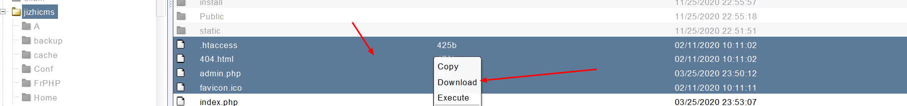

# Cobaltstrike

**图形界面** 

**建立的会话比msf稳定**

**与msf相比，cs可以多用可以有多个客户端，适合团队使用**

**有客户端（个人pc上面）和服务端(放到vps运行，侦听50050端口)**

**通过客服端连接vps服务端的服务端，生成木马（地址为vps地址）,发送到目标机器，让靶机连接vps**

### 建立连接

#### 启动服务端

```
teamserver.bat 10.3.0.72 adminadmin
下面产生的指纹是为了防止中间人攻击(比对客户端和服务端的ssl指纹是否一致)
```


#### 启动客户端，连接服务端


#### 完成一次会话生成

##### 1、选择耳机按钮，把默认的侦听删除，配置建立侦听


##### 2、选择齿轮，生成exe木马程序


##### 将生成的exe上传到目标主机运行，发现成功建立回连会话


##### 进入beacon


**即sleep时间为0s，进入交互模式（默认是60s后发送一个心跳包）**

```
注意:
sleep 0 执行之后需要右上角的last 时间走完一分钟才会生效
```


##### 在执行命令的时候需要在命令前面添加shell(和empire特别像)


#### 多用户协同

##### kali 中连接该服务端


##### 互相发送信息沟通


```
external 映射的外部地址(真正的服务器都会进行地址池或者静态nat映射)
internal 内部地址
user 表示当前用户权限
process 表示该会话的执行的程序
pid 表示该会话执行程序的进程id
```


#### 提权

```
这里默认只有uac和svc提权
```


```
beacon中可以查看提权执行的命令
```


```
提权成功之后会生成对应的会话 process进程也会对应更改
```


#### 派生会话

```
从当前的会话中派生会话,成功之后会再生成一个会话
派生会话选择的监听类型为tcp或者smb(貌似不支持其他类型协议)
```

##### 建立监听器


##### 派生会话


##### 选择监听器为smb或者tcp(这里两种都派生了)


##### 派生的会话已经生成

```
需要注意的时候
派生的会话有特殊的标记
```


```
上面的图:

防火墙着火 表示外网

虚线表示能与外网连接(出网的http协议)

实现表示不能出网

绿色表示http协议

橙色表示smb协议

蓝色表示tcp协议

电脑出现闪电、红色、* 表示至少是管理员权限
```

#### 转储hash


#### 文件管理

**文件下载**





#### 端口扫描(内网使用arp协议)


**扫描完之后通过右键服务查看**


#### 进程注入、未完待续
