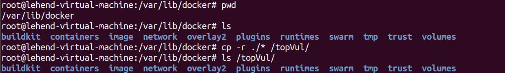
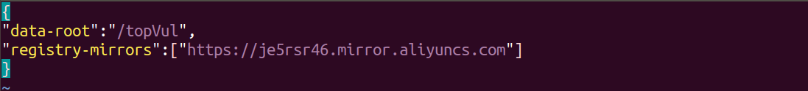
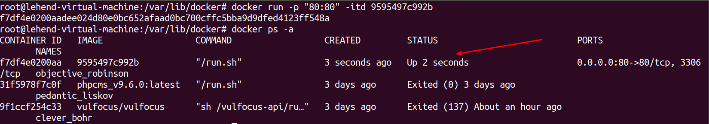

# Ubuntu 18.04修改Docker默认镜像的存储路径

## 一、初始操作

### 1、获取Docker的默认存放位置

`docker info | grep "Docker Root Dir"`

### 2、停止docker服务

### 3、复制整个/var/lib/docker目录到目的路径，这里目的路径是`/topVul`

## 二、修改镜像和容器的默认存放路径

1.Docker的配置文件可以设置大部分的后台进程参数，在各个操作系统中的存放位置不一致，在 Ubuntu 中的位置是：`/etc/default/docker`，在 CentOS中的位置是：`/etc/sysconfig/docker`。

### a、如果是 CentOS6 则添加下面这行：

​		`OPTIONS=--graph="/data/tools/docker"--selinux-enabled -H fd://`

### b、如果是 Ubuntu 则添加下面这行（因为 Ubuntu 默认没开启 selinux）：

​		`OPTIONS=--graph="/data/tools/docker" -H fd://#` 或者 `DOCKER_OPTS="-g /data/tools/docker"`

最后重新启动，Docker 的路径就改成 /data/tools/docker 了。

### c、如果是CentOS7 就是用如下：

#### 1.修改`docker.service`文件，使用`--graph`参数指定存储位置

`sudo   vim   /usr/lib/systemd/system/docker.service `

文本内容：`ExecStart=/usr/bin/dockerd`下面添加如下内容：

​	`--graph /data/tools/docker`

#### 2.修改完成后reload配置文件

sudo systemctl daemon-reload

#### 3.重启docker服务

sudo systemctl  restart docker.service

#### 4.修改默认存储路径的已经完成

备注：如果docker是1.12或以上的版本，可以修改（或新建）daemon.json文件。修改后会立即生效，不需重启docker服务。

`sudo  vim  /etc/docker/daemon.json`

修改如下：

    {
    "registry-mirrors": ["http://***.***.com"],
    "graph":"/data/tools/docker"
    }

####  5.注意：

​		docker 版本为17及最新版本都是用 `data-root`代替`graph`了，这里的修改请一定确认好你的docker版本，最新的有最新的要求和规则
`vim /etc/docker/daemon.json`

    {
    "data-root":"/topVul",
    "registry-mirrors":["https://je5rsr46.mirror.aliyuncs.com"]
    }

## 三、实际操作

### 1、获取Docker的默认存放位置

`docker info | grep "Docker Root Dir"`

### 2、停止docker服务

### 3、复制`/var/lib/docker`文件内容到目的路径`/topVul`下面

### 4、使用的是ubuntu18.04，查看当前docker版本 ，进行docker镜像和容器路径编辑操作

`docker info | grep "Server Version"`

由于`Version > 17`，所以进行如下操作

`vim /etc/docker/daemon.json`

    {
    "data-root":"/topVul",
    "registry-mirrors":["https://je5rsr46.mirror.aliyuncs.com"]
    }

### 5、删除`/var/lib/docker/`目录下的所有内容（不建议）

`rm -rf /var/lib/docker/*`

### 6、重启docker服务`service docker restart`

可以发现之前目录下的所有docker镜像都已经完全迁移到`/topVul`下

### 7、运行对应镜像，检查能否正常访问

`docker run -p "80:80" -itd 9595497c992b`

`docker ps -a`

### 8、检查后能够正常访问，至此修改默认存储路径的已经完成

**参考链接：**`https://blog.csdn.net/u013948858/article/details/78424115`