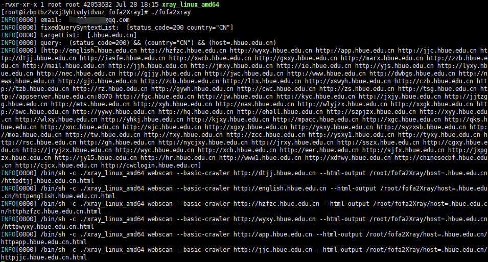

**fofa2简介**

**fofa2+Xray**

  **一款联合fofa与xray的自动化批量扫描工具.使用Golang编写.适用于**windows与linux.**

**0x01原理**
  **使用fofa api批量获取指定数据,然后使用xray进行主动扫描.**

**0x02实例**


**0x03快速使用**
**一、移动xray可执行程序到fofa2Xray同一目录(自带xray版本为1.1.0)**

****

**二、修改配置文件**

```java
fofa:
  email: {fofa账户}
  key: {fofaKey}

  # 固定查询语句
  fixedQuerySyntexList:
    - status_code=200
    - country="CN"

  # 查询语法
  # 更多查询语法见https://fofa.so/
  querySyntax: host

  # 使用querySyntax查询语法分别查询target
  targetList:
    - .hubu.edu.cn
#    - .hbue.edu.cn
#    - .wust.edu.cn
xray:
  #path没有用，必须把xray可执行文件放在脚本同一目录
  path: D:\CyberSecurityTools\xray_windows_amd64\xray_windows_amd64.exe

  #fofa2Xray相同目录下xray的全名
  name: xray_windows_amd64.exe

  #同时运行xray的最大数
  thread: 10
```
**三、启动fofa2Xray**

```java
./fofa2Xray
nohup ./fofa2Xray & // 持久化
```

**0x04  Github项目地址**

```java
https://github.com/piaolin/fofa2Xray/releases
```
