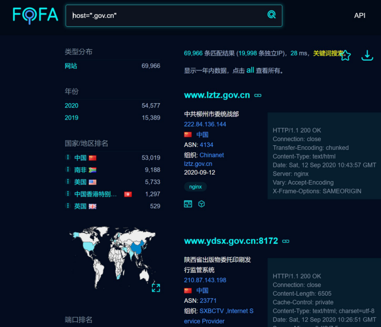
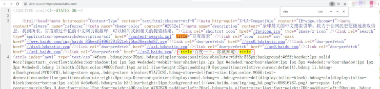
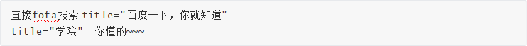
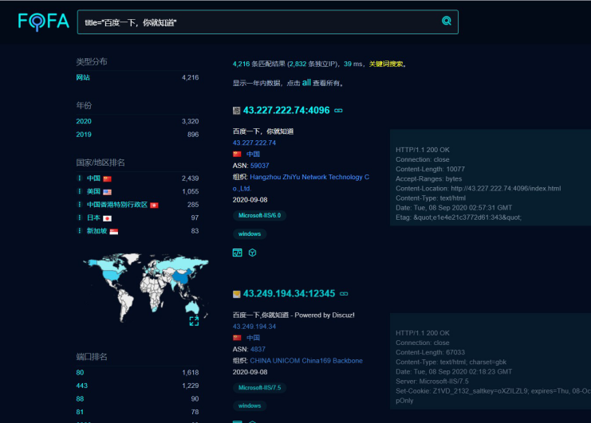
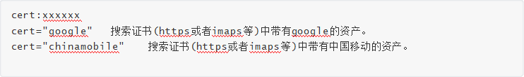
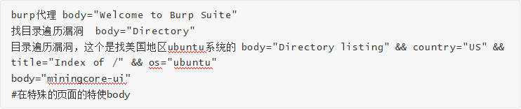
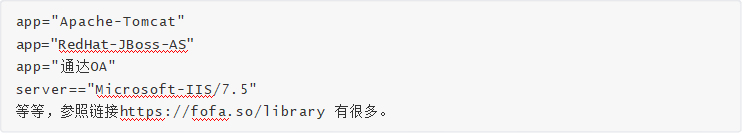
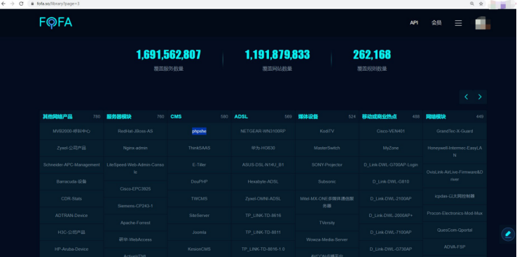
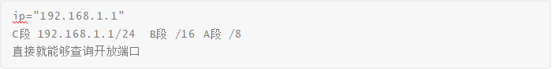
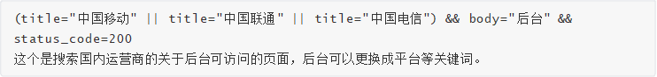

# fofa使用

## 一、检索HTML源代码

####  0、在url中找关键字

[host!=".gov.cn"](https://fofa.so/result?qbase64=aG9zdD0iLmdvdi5jbiI%3D)

 

结果如图

搜索的记过是url中有的，类似于google中搜索的 "inurl:index.html"

#### 1、title标签检索：

在两个title标签之间的文字。支持关键字搜索。很好用

 

 

 

#### 2、cert证书信息检索

 

#### 3、找body特征信息：

例如：

 

#### 4、http的header中搜索

 

#### 5、服务器状态码

 

#### 6、icon搜索

能够直接搜索图片。秀！

#### 7、搜索使用的数据库

 

#### 8、搜索使用的中间件或者其他应用

 

 

查询搜索参考：https://fofa.so/library

#### 9、搜索子域

 

## 二、资产搜索

搜索IP或者C段

 

## 三、联合搜索高级用法
或
 

 