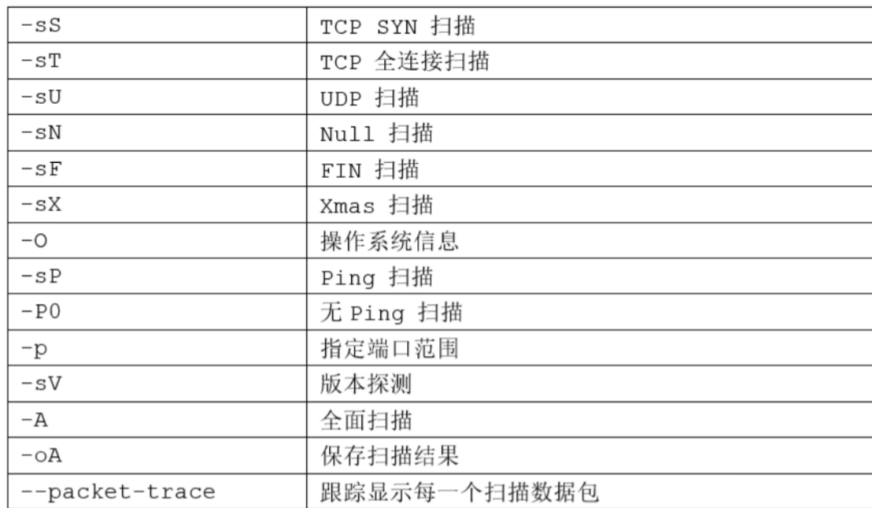

```
1.使用nmap探测。nmap -A -v -T4 目标ip
2.使用masscan探测(kali自带)

 

-sT  TCP connect() 扫描，这是最基本的 TCP 扫描方式。

这种扫描很容易被检测到，在目标主机的日志中会记录大批的连接请求以及错误信息。   

-sS   TCP 同步扫描 (TCP SYN)，因为不必全部打开一个 TCP 连接，所以这项技术通常称为半开扫描 (half-open)。这项技术最大的好处是，很少有系统能够把这记入系统日志。不过，你需要 root 权限来定制 SYN 数据包。   

-sF,   秘密 FIN 数据包扫描

-sX, 	圣诞树 (Xmas Tree)

-sN   空 (Null) 扫描模式。

这些扫描方式的理论依据是：关闭的端口需要对你的探测包回应 RST 包，而打开的端口必需忽略有问题的包（参考 RFC 793 第 64 页）。   

-sP   ping 扫描，用 ping 方式检查网络上哪些主机正在运行。当

主机阻塞 ICMP <span class="hljs-built_in">echo</span> 请求包是 ping 扫描是无效的。nmap 在任何情况下都会进行 ping 扫描，只有目标主机处于运行状态，才会进行后续的扫描。   

-sU   UDP 的数据包进行扫描，如果你想知道在某台主机上提供哪些 UDP（用户数据报协议，RFC768) 服`务，可以使用此选项。   

-sA   ACK 扫描，这项高级的扫描方法通常可以用来穿过防火墙。   

-sW   滑动窗口扫描，非常类似于 ACK 的扫描。   

-sR   RPC 扫描，和其它不同的端口扫描方法结合使用。   

-b   FTP 反弹攻击 (bounce attack)，连接到防火墙后面的一台 FTP 服务器做代理，接着进行端口扫描。

-P0   在扫描之前，不 ping 主机。  

-PT  扫描之前，使用 TCP ping 确定哪些主机正在运行。   

-PS   对于 root 用户，这个选项让 nmap 使用 SYN 包而不是 ACK 包来对目标主机进行扫描。   

-PI   设置这个选项，让 nmap 使用真正的 ping(ICMP <span class="hljs-built_in">echo</span> 请求）来扫描目标主机是否正在运行。   

-PB  这是默认的 ping 扫描选项。它使用 ACK(-PT) 和 ICMP(-PI) 两种扫描类型并行扫描。

如果防火墙能够过滤其中一种包，使用这种方法，你就能够穿过防火墙。   

-O  这个选项激活对 TCP/IP 指纹特征 (fingerprinting) 的扫描，获得远程主机的标志，也就是操作系统类型。   

-I   打开 nmap 的反向标志扫描功能。   

-f   使用碎片 IP 数据包发送 SYN、FIN、XMAS、NULL。包增加包过滤、入侵检测系统的难度，使其无法知道你的企图。   

-v  冗余模式。强烈推荐使用这个选项，它会给出扫描过程中的详细信息。   

-S <IP>   在一些情况下，nmap 可能无法确定你的源地址 (nmap 会告诉你）。

在这种情况使用这个选项给出你的 IP 地址。   

-g port  设置扫描的源端口。一些天真的防火墙和包过滤器的规则集允许源端口为 DNS(53) 或者 FTP-DATA(20) 的包通过和实现连接。显然，如果攻击者把源端口修改为 20 或者 53，就可以摧毁防火墙的防护。   

-oN  把扫描结果重定向到一个可读的文件 logfilename 中。   

-oS   扫描结果输出到标准输出。   

--host_timeout  设置扫描一台主机的时间，以毫秒为单位。默认的情况下，没有超时限制。   

--max_rtt_timeout  设置对每次探测的等待时间，以毫秒为单位。如果超过这个时间限制就重传或者超时。默认值是大约 9000 毫秒。   

--min_rtt_timeout   设置 nmap 对每次探测至少等待你指定的时间，以毫秒为单位。   

-M count   置进行 TCP connect() 扫描时，最多使用多少个套接字进行并行的扫描。
```

 

### nmap扫描返回几种状态，分别代表什么意思？

```
当nmap向目标主机发送报文并根据返回报文从而认定端口的6种状态的含义（注意：这六种状态只是namp认为的端口状态，例如：有些主机或者防火墙会返回一些不可靠的报文从而妨碍nmap对端口开放问题的确认
```

```

1.Open：端口处于开放状态，例如：当nmap使用TCP SYN对目标主机某一范围的端口进行扫描时，我们知道 TCP SYN报文是TCP建立连接的第一步，所以，如果目标主机返回SYN+ACK的报文，我们就认为此端口开放了并且使用了TCP服务。

2.Closed：端口处于关闭状态。例如：TCP SYN类型的扫描，如果返回RST类型的报文，则端口处于管理状态。这里我们值得注意的是关闭的端口也是可访问的，只是没有上层的服务在监听这个端口，而且，只是在我们扫描的这个时刻为关闭，当我们在另一个时间段进行扫描的时候，这些关闭的端口可能会处于open的状态。

3.Filtered（过滤的）：由于报文无法到达指定的端口，nmap不能够决定端口的开放状态，这主要是由于网络或者目标主机安装了一些防火墙导致的。

4.Unfiltered（未被过滤的），当nmap不能确定端口是否开放的时候所打上的状态，这种状态和filtered的区别在于：unfiltered的端口能被nmap访问，但是nmap根据返回的报文无法确定端口的开放状态，而filtered的端口直接就没能够被nmap访问。

5.Open|filtered状态，这种状态主要是nmap无法区别端口处于open状态还是filtered状态。

6.Closed|filtered状态，这种状态主要出现在nmap无法区分端口处于closed还是filtered时。
```

