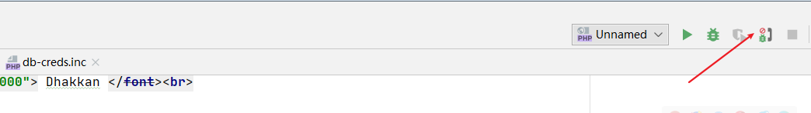
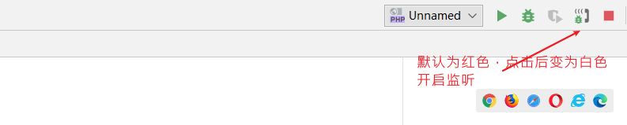
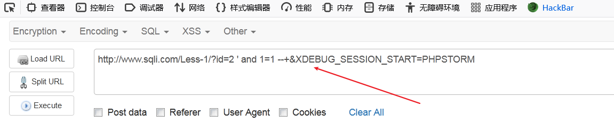
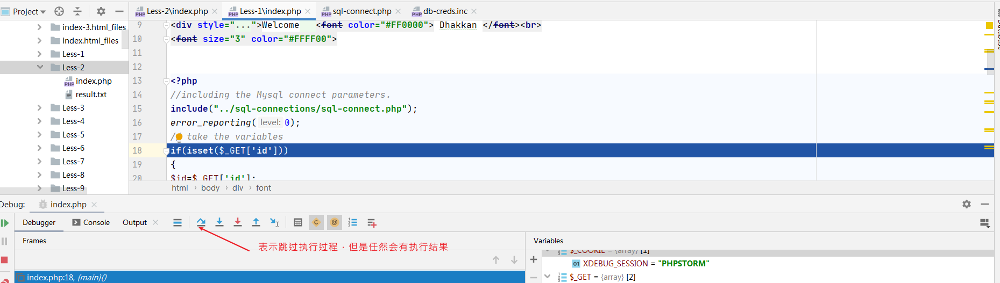
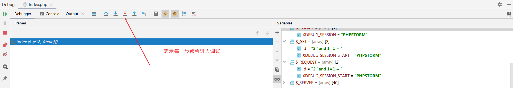
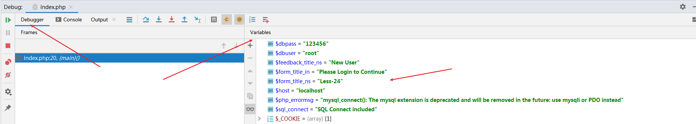

**phpstorm开启监听**





**在请求末尾添加phpstorm的参数 能够让phpstorm进行识别**

```
&XDEBUG_SESSION_START=PHPSTORM

http://www.sqli.com/Less-1/?id=2 ' and 1=1 --+&XDEBUG_SESSION_START=PHPSTORM
```




**debug调试**




**一般查看的是debugger 和variables**
